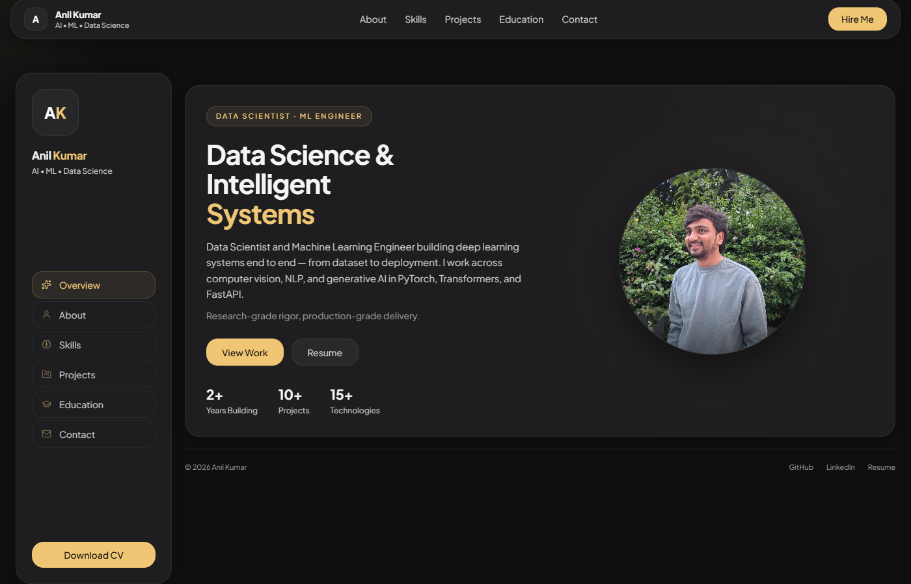
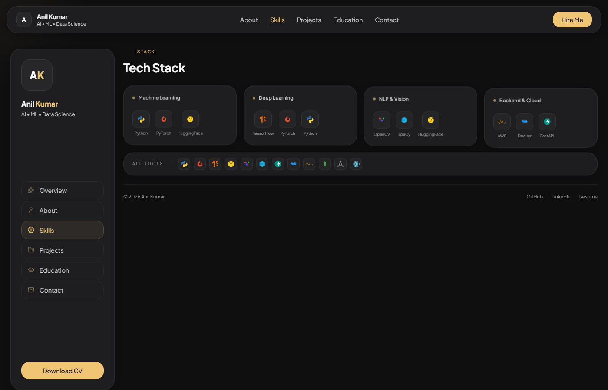
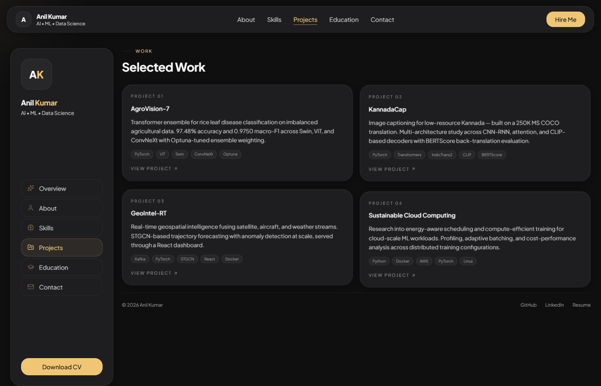
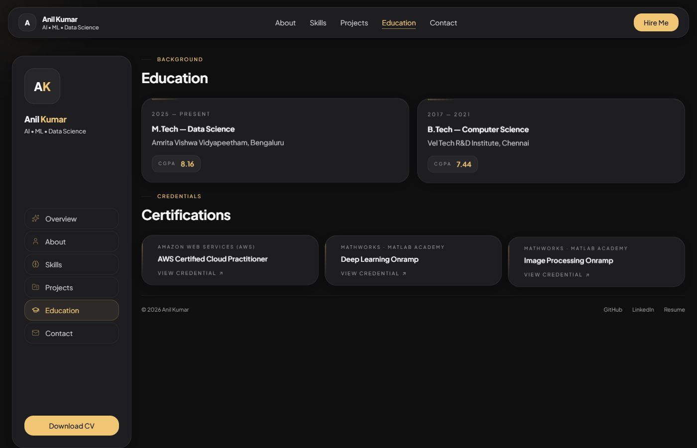
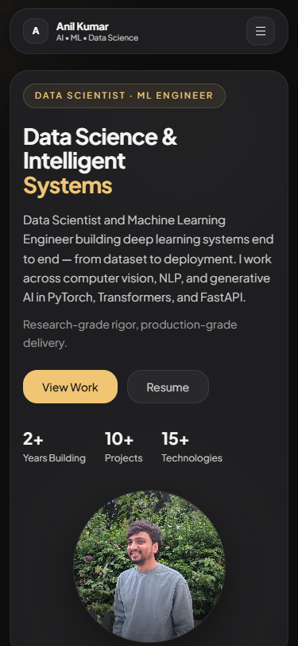

# Anil Kumar — Portfolio

A modern, dark-themed personal portfolio built with React, Vite, and Tailwind CSS. Features smooth Framer Motion animations, a dashboard-style sidebar navigation, and a fully responsive layout.

## Demo

**Live:** [portfolio-phi-five-40.vercel.app](https://portfolio-phi-five-40.vercel.app)

## Screenshots

### Desktop



| Skills | Projects |
|--------|----------|
|  |  |



### Mobile

<p align="center">
  
</p>

## Features

- **Dashboard Layout** — Persistent sidebar navigation with section switching (no page reloads)
- **Framer Motion Animations** — Smooth page transitions, hover effects, and scroll-triggered reveals
- **Mouse Glow Effect** — Subtle cursor-following radial glow across the entire viewport
- **Dark Theme with Gold Accents** — Cohesive `#0f0f10` / `#f0c674` color system
- **Responsive Design** — Adapts from mobile (top nav) to desktop (sidebar + content)
- **Component Sections** — Hero, About, Focus Areas, Skills, Projects, Education, Certifications, Contact
- **Custom SVG Tech Logos** — Hand-crafted inline SVGs for Python, PyTorch, TensorFlow, Docker, and more
- **Profile Photo Fallback** — Graceful degradation to initials if the profile image is missing

## Tech Stack

| Layer      | Technology                          |
|------------|-------------------------------------|
| Framework  | React 19                            |
| Build Tool | Vite 7                              |
| Styling    | Tailwind CSS 3                      |
| Animation  | Framer Motion                       |
| Icons      | Lucide React + Custom SVGs          |
| Font       | Plus Jakarta Sans (Google Fonts)    |
| Deployment | Vercel                              |

## Installation

```bash
# Clone the repository
git clone https://github.com/lucky07-07/portfolio.git
cd portfolio

# Install dependencies
npm install

# Start development server
npm run dev

# Build for production
npm run build

# Preview production build
npm run preview
```

## Usage

Open [http://localhost:5173](http://localhost:5173) in your browser. Use the sidebar (desktop) or top navigation (mobile) to switch between sections.

To add your own profile photo, place a `profile.jpg` in the `public/` directory. To add a downloadable resume, place `resume.pdf` in `public/`.

## Folder Structure

```
portfolio/
├── public/
│   ├── profile.jpg          # Profile photo
│   └── vite.svg             # Favicon
├── src/
│   ├── components/
│   │   ├── About.jsx        # About section with bio and skills
│   │   ├── Certifications.jsx
│   │   ├── Contact.jsx      # Email, LinkedIn, GitHub links
│   │   ├── Education.jsx    # Academic background
│   │   ├── FocusAreas.jsx   # Discipline tags grid
│   │   ├── Footer.jsx       # Footer with external links
│   │   ├── Hero.jsx         # Landing section with profile
│   │   ├── MouseGlow.jsx    # Cursor-following glow effect
│   │   ├── Navbar.jsx       # Top navigation bar
│   │   ├── Projects.jsx     # Selected work cards
│   │   ├── ScrollProgress.jsx
│   │   └── Skills.jsx       # Tech stack with SVG logos
│   ├── App.jsx              # Main layout + section router
│   ├── index.css            # Global styles + card system
│   └── main.jsx             # React entry point
├── index.html
├── tailwind.config.js
├── vite.config.js
├── postcss.config.js
└── package.json
```

## Future Improvements

- [ ] Add a blog section with MDX support
- [ ] Integrate a headless CMS for dynamic project content
- [ ] Add light/dark theme toggle
- [ ] Implement page transition routing with React Router
- [ ] Add project detail pages with case studies
- [ ] Integrate contact form with email service (Resend / EmailJS)
- [ ] Add SEO meta tags and Open Graph images

## License

MIT License — feel free to fork and customize for your own portfolio.
